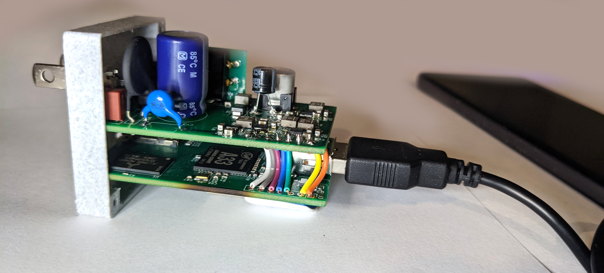

# Wifiwart



The WiFiWart is an open source WiFi penetration device masquerading as a
regular wall charger. It features a 1.2Ghz Cortex A7 MPU with two WiFi
chips onboard. The electrical, mechanical and software is all completely
open source. The elec is design in Kicad, hardware in FreeCAD and software
will be all GNU/Linux based. Eventually there will be three PCBs in this
repository. Rather than placing redundant information in this file, I would
encourage readers to check out the blog series listed below for a very in
depth walk through.

- [Blog Post #3](https://machinehum.medium.com/im-putting-a-wifi-router-into-a-wall-charger-part-2-bf04c779c905)
- [Blog Post #2](https://machinehum.medium.com/im-putting-a-wifi-router-into-a-wall-charger-part-1-882df714bbf3) - [Hackaday Feature](https://hackaday.com/2021/07/03/wifiwart-linux-pentesting-device-gets-first-pcbs/)
- [Blog Post #1](https://machinehum.medium.com/im-putting-a-wifi-router-into-a-wall-charger-part-0-2c1e1a80ccde) - [Hackaday Feature](https://hackaday.com/2021/05/06/putting-an-ultra-tiny-linux-board-in-a-phone-charger-eventually/)
- [Join us on Discord!](https://discord.gg/EtZT7mjNuM)

## Repository Structure.
``` bash
.
|-- electronics
|   |-- app_notes
|   |-- datasheets             # Datasheets of the parts used
|   |-- nff_comp_pcb           # "Non-Form-Factor" build
|   |   |-- generate_bom.py    # This is used to generate the bom
|   |   |-- gpio.sch
|   |   |-- hardware-cache.lib
|   |   |-- hardware.kicad_pcb
|   |   |-- hardware.pro
|   |   |-- hardware.sch
|   |   |-- R0.1                # First Revision Build files
|   |   |-- Renders             # Pics of the board
|   |   |-- replace.sh          # Don't run this
|   |   |-- step             
|   |   |-- sym-lib-table
|   |   `-- ti
|   `-- scripts
|       |-- crystal_caps.m
|       |-- psu_current.m
|       `-- psu_resistor.m
|-- LICENSE
|-- mech                         # Mechanical Design
|   |-- case.FCStd
|   |-- lid.FCStd
|   |-- prong.FCStd
|   `-- refs
|-- notes
|-- plan
|   |-- gantt.tex
|   |-- Makefile
|   `-- notes
`-- readme.md
```

# FF Board information
60mm x 37mm
